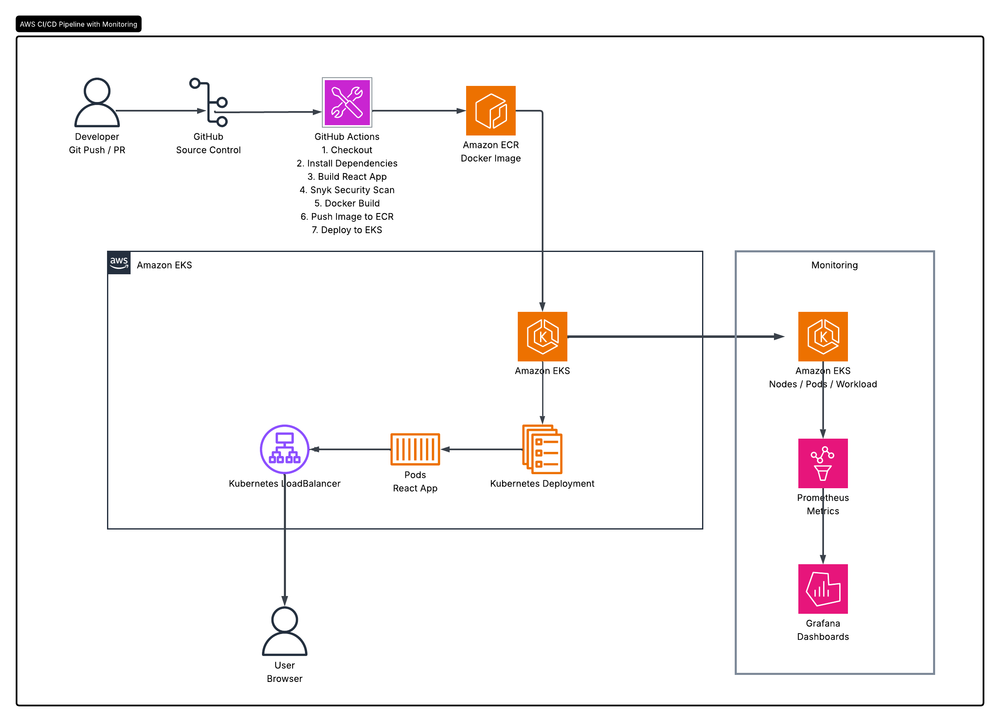
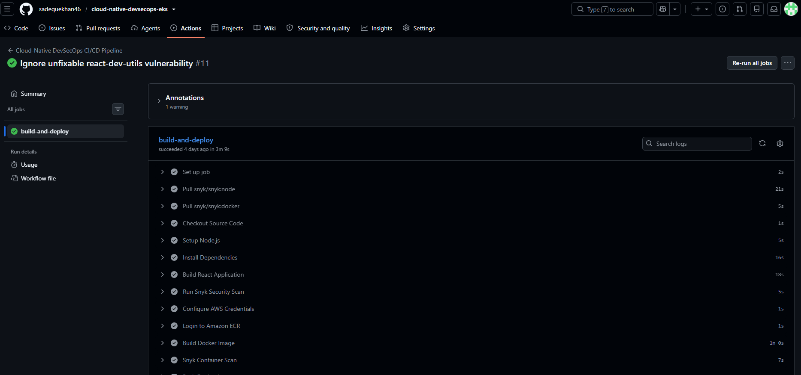
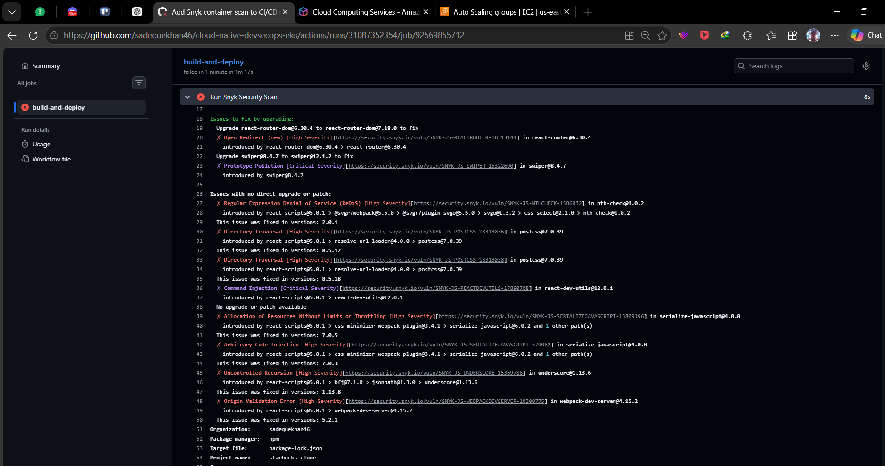
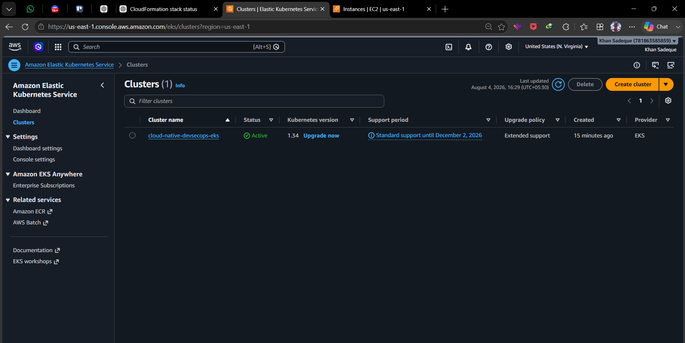
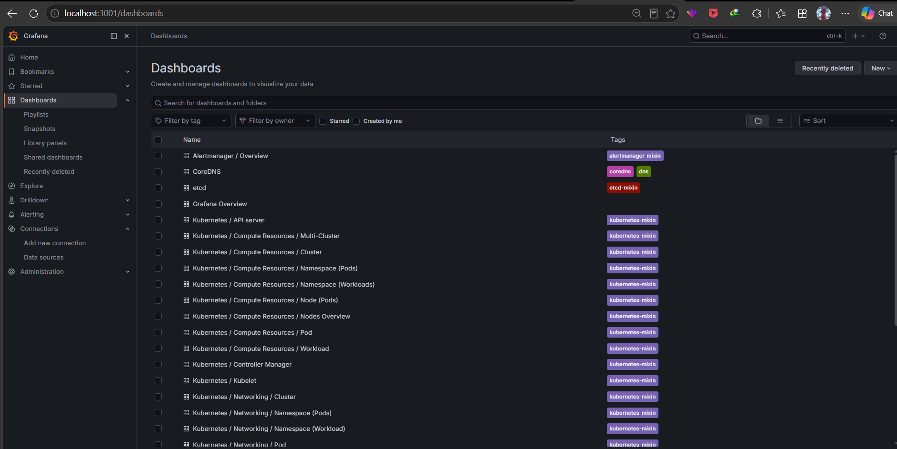

# Cloud-Native DevSecOps on AWS EKS
A production-style **Cloud-Native DevSecOps project** that automates the build, security scanning, containerization, deployment, and monitoring of a React application on **Amazon EKS**.
## Overview
The project implements an end-to-end CI/CD pipeline using **GitHub Actions**, with security integrated through **Snyk**. The application is containerized with Docker, stored in **Amazon ECR**, and deployed automatically to **Amazon EKS**.

The Kubernetes environment is monitored using **Prometheus and Grafana**.

---
##  Architecture



---

##  Technology Stack

| Category | Technologies |
|---|---|
| Application | React, JavaScript, Tailwind CSS |
| Source Control | Git, GitHub |
| CI/CD | GitHub Actions |
| Security | Snyk |
| Containerization | Docker |
| Container Registry | Amazon ECR |
| Cloud | AWS |
| Orchestration | Amazon EKS, Kubernetes |
| Package Management | Helm |
| Monitoring | Prometheus, Grafana |

---

##  CI/CD Workflow

```text
Git Push
   ↓
GitHub Actions
   ↓
Install Dependencies
   ↓
React Production Build
   ↓
Snyk Security Scan
   ↓
Docker Image Build
   ↓
Push Image → Amazon ECR
   ↓
Update Kubernetes Deployment
   ↓
Amazon EKS
   ↓
Rollout Verification
```
The pipeline uses the commit SHA as the Docker image tag, providing traceability between a Git commit and the deployed container.

---

##  DevSecOps Security
Snyk is integrated into the CI/CD pipeline to identify vulnerable dependencies before deployment.
```bash
snyk test --severity-threshold=high
```
The security gate is configured to stop the pipeline when vulnerabilities meeting the configured severity threshold are detected.
AWS credentials and Snyk credentials are stored securely using **GitHub Actions Secrets**.

---

##  Kubernetes Deployment

The application is deployed to Amazon EKS using Kubernetes resources.
```text
Namespace
   │
   └── Deployment
         │
         ├── Pod
         ├── Pod
         └── Pod
              │
              ▼
          Service
              │
              ▼
        AWS LoadBalancer
```
Verify the deployment:

```bash
kubectl get pods -n cloud-native-devsecops
kubectl get deployment -n cloud-native-devsecops
kubectl get svc -n cloud-native-devsecops
```
---
##  Monitoring
The project uses **kube-prometheus-stack** for Kubernetes monitoring.

### Prometheus
Collects metrics from:
- Kubernetes nodes
- Pods
- Deployments
- Containers
- Kubernetes components

### Grafana
Provides dashboards for:
- Cluster resources
- Node resources
- Pod resources
- Workloads
- Application infrastructure

Example dashboards are stored under:
```text
monitoring/grafana/dashboards/
```
Access Grafana locally:
```bash
kubectl port-forward svc/monitoring-grafana 3001:80 -n monitoring
```
Then open:
```text
http://localhost:3001
```
---

##  Local Setup
Clone the repository:
```bash
git clone https://github.com/sadequekhan46/cloud-native-devsecops-eks.git
cd cloud-native-devsecops-eks
```
Install dependencies:
```bash
npm install
```
Run locally:
```bash
npm start
```
Application:
```text
http://localhost:3000
```
---

##  Deployment
Configure AWS credentials:
```bash
aws configure
```
Update EKS access:
```bash
aws eks update-kubeconfig --region us-east-1 --name cloud-native-devsecops-eks
```
Verify the cluster:
```bash
kubectl get nodes
```
The application can then be deployed through the GitHub Actions pipeline.

---
## 📸 Screenshots

### Application


### CI/CD Pipeline



### Snyk Security Scan



### Amazon EKS



### Grafana Monitoring



---
##  Key Features
- Automated CI/CD with GitHub Actions
- Dependency security scanning with Snyk
- Docker-based application deployment
- Amazon ECR image management
- Kubernetes deployment on Amazon EKS
- AWS LoadBalancer-based application access
- Prometheus-based infrastructure monitoring
- Grafana dashboards
- Version-controlled monitoring configuration
- Kubernetes rollout verification
---
##  Future Enhancements
- Kubernetes security hardening
- Resource limits and health probes
- Horizontal Pod Autoscaling
- Automated rollback
- GitOps with Argo CD
- Centralized logging with Loki
---
##  Author
**Khan Sadeque**
Cloud & DevOps Enthusiast | MCA Graduate